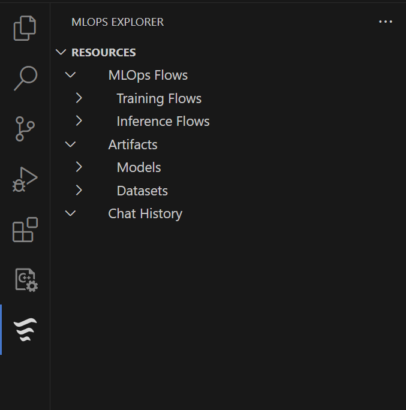
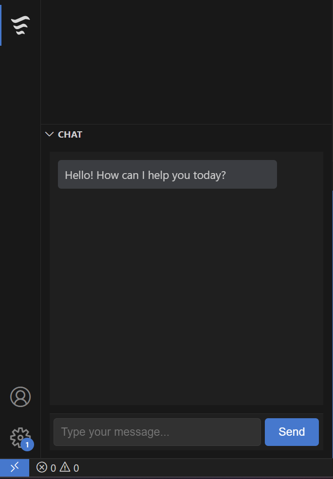

# mlops-extension README

This is the README for your extension **"mlops-extension"**.  
Below you'll find a description, features, requirements, settings, known issues, and release notes.

---

## Features

- **MLOps Explorer:**  
  Adds a new activity bar icon for MLOps workflows.
- **Resource Tree View:**  
  Browse and manage flows, artifacts, and chat history in a hierarchical tree.
- **Integrated Chat Panel:**  
  Chat with your MLOps agent directly inside VS Code, with input box and send button.
- **Command Palette Integration:**  
  Start flows, deploy models, view chat history, and refresh resources using VS Code commands.

**Screenshots:**

  
*Resource tree view in the MLOps Explorer.*

  
*Chat panel with input and message bubbles.*

---

## Requirements

- **VS Code** version 1.60.0 or higher
- **Node.js** (for development)
- **AWS Account** (for backend integration: Bedrock, Cognito, DynamoDB, S3)
- Internet connection for cloud features

---

## Extension Settings

This extension contributes the following settings:

- `mlopsExtension.enable`: Enable/disable the MLOps extension.
- `mlopsExtension.apiEndpoint`: Set the backend API endpoint for chat and resource management.
- `mlopsExtension.logLevel`: Set the log verbosity (info, debug, error).

---

## Known Issues

- Chat panel may not display if webview registration fails (see Output panel for errors).
- Large resource trees may cause slow loading.
- AWS integration requires valid credentials and configuration.

---

## Release Notes

### 1.0.0

- Initial release of **mlops-extension**
- MLOps Explorer with resource tree and chat panel
- Basic command palette actions

### 1.0.1

- Fixed chat panel rendering issue on some VS Code themes

### 1.1.0

- Added backend API integration for chat
- Improved error handling and logging
- Enhanced UI with VS Code theming
